#### Seguramente en alguna ocasión se te presento la problemática de como podrías manejar más de una cuenta de usuario...

en algunos de los servidores que almacenan tus repositorios remotos en la misma maquina cliente con git, en esta ocasión expondré como resolver el problema puntualmente para el caso específico siguiente : teniendo en cuenta la tan afamada plataforma GitHub y una maquina cliente con sistema operativo Windows, ya que en Linux nunca he tenido este problema XD, pues sin más preámbulo comencemos:

Básicamente listare el proceso que sigue para dar solvencia al problema a tratar:

1.	Generar una clave ssh.
2.	Iniciar el ssh-agent.
3.	Agregar la clave privada al ssh-agent.
4.	Agregar la clave ssh publica a la plataforma GitHub.
5.	Establecer el seudónimo del repositorio con una url ssh.

Y eso es todo amigos :), no se preocupen que lo hare un poco más detallado, pero quise dar de una forma resumida los pasos necesarios para aquel programador o programadora que ya haya trabajado con ssh antes.

Nota: Antes de ir de lleno con los pasos, como es obvio deberían de tener instalado git, y debemos ir a la ruta de instalación de git que generalmente es “C:\Program Files\Git”, dentro de esta ruta deberíamos encontrar los programas para el manejo de SSH, como el  tutorial en esta ocasión no va dirigido a explicar que es y cómo funciona SSH, aquí un link para saber más, en la versión 2.10 de Git se encuentras estos programas dentro de /usr/bin/, así que para ese caso en concreto quedaría de la siguiente manera la ruta completa de los programas que manejan SSH : C:\Program Files\Git\usr\bin, para aquellos que no tengan una ruta similar, seguro que ustedes son unas personas muy listillas y deberían encontrarlos en alguna parte de la ruta de la instalación  por defecto de git, antes de que se me pase los programas que buscamos, se llaman de la siguiente manera : ssh-keygen, ssh-agent, ssh-add, con sus puntos exe’s respectivos, dado la obviedad del sistema operativo,  y disculpen por ser tan obvio XD, y… ya se, ya se, el punto de el porqué de todo esto es agregar esa ruta donde se encuentran esos programas a la variable de entorno PATH, para que como ustedes saben, puedan ser ejecutados desde la terminal(CMD) independientemente de la ruta de la terminal donde se encuentren, en fin como ustedes saben para eso sirve esa variable de entorno, para aquellos que nunca han hecho algo como agregar una un valor a la variable de entorno path, les dejare un pequeño tuto de como hacerlo, para los que ya sepan, porfavor sientanse libres de saltarse esta parte :).

Nos dirigimos hacia nuestro explorador y hacemos click secuandario en “Este equipo”, se abrirá un menú contextual, damos click en “Propiedades”, como se puede apreciar en la figura 1.1

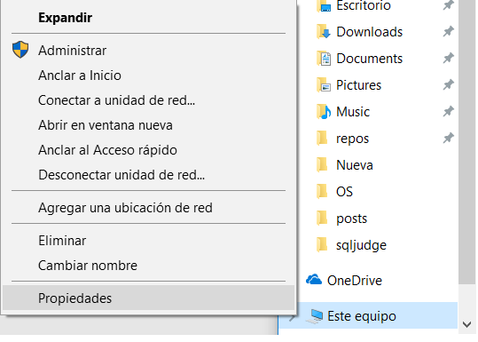

Figura 1.1

A continuación, se nos abrirá una ventana con la información de hardware y software de nuestra maquina nos dirigimos hacia la parte izquierda de la pantalla y buscamos el enlace de la figura 1.2

Figura 1.2

Nos aparecerá una ventana como la siguiente, daremos click en el botón “Variables de entorno…” como se puede apreciar en la figura 1.3

Figura 1.3

Nuestra Siguiente ventana es donde aparecen todas nuestras variables de entorno, y como saben la que buscamos es variable de entorno PATH, la buscamos, la seleccionamos y hacemos click en el botón editar como se muestra en la figura 1.4

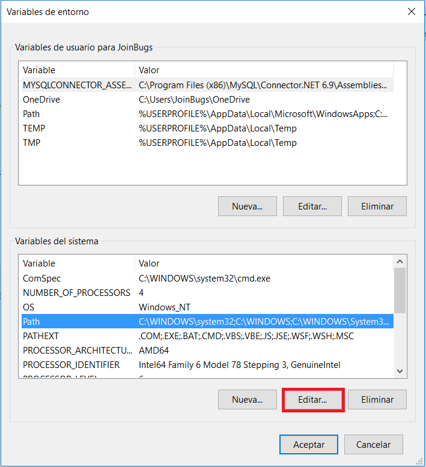

Figura 1.4

En nuestra última ventana aparecen todos los valores que posee nuestra variable de entorno como se puede apreciar en la figura 1.5, asi que agregaremos uno más, damos click en el botón de Nuevo, pegamos la ruta donde se encuentran los programas SSH que necesitamos, en el nuevo campo de texto que aparecerá y para finalizar damos en aceptar y cerramos las demás sub ventanas abiertas.

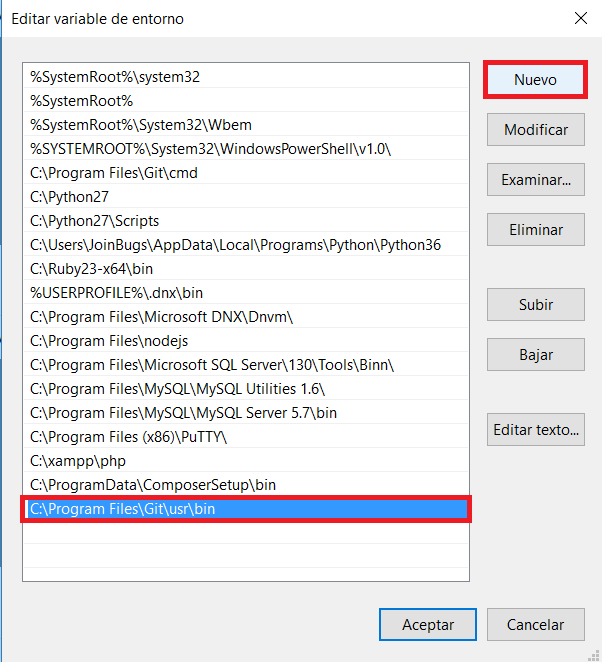

Figura 1.5

Estas configuraciones pueden variar dependiendo de la versión del sistema operativo Windows que tengan sus máquinas, pero como ya lo había dicho unas personas listillas como ustedes seguro sabran arreglárselas ;).

Bueno, después de la ENORME NOTA, ahora si comencemos:

Paso1 – Generar una clave ssh
Una vez agregada la ruta de nuestros programas ssh a la variable entorno PATH, abrimos una instancia de nuestra terminal(CMD) y tecleamos en ella lo siguiente:                                                  ssh-keygen –t rsa –C “micorreo@midominio.com”, este comando creara dos claves SSH una clave pública y una clave privada, también le estamos indicando 2 parámetros al comando, el primero “–t” donde le pasamos “rsa” este le indica al comando el tipo de sistema criptográfico a utilizar, el siguiente parámetro es –C donde recibe algún tipo de comentario, en este caso le pasamos nuestro correo electrónico, este último es opcional, pero lo sugiero para identificar la clave pública generada

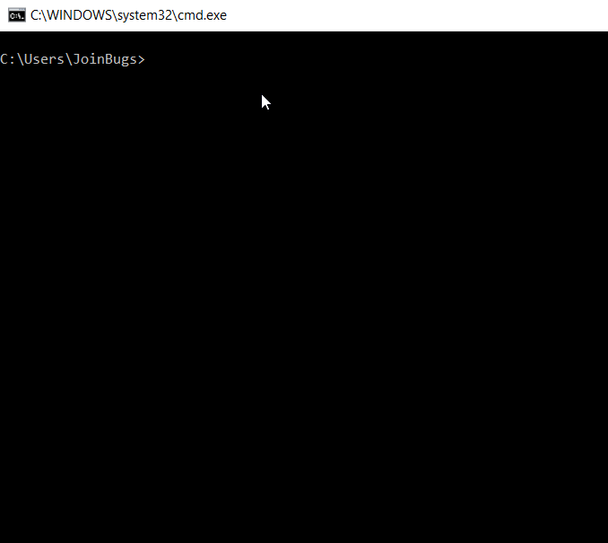

Figura 1.6

En el ejemplo de la figura 1.6, se crea un folder para almacenar nuestras llaves ssh, posteriormente se ejecuta el comando mencionado con anterioridad y este mismo pide un nombre para el archivos de las llaves ssh, en el ejemplo se nombra como myssh, y agregando una segunda capa de seguridad se solicita una contraseña para la clave a generar y se repite este paso, una vez hecho esto, se generan dos archivos uno es la clave privada llamada en este caso myssh, y la segunda es la clave pública que se distingue por tener la extensión “.pub” de publica.

Paso 2 - Iniciar el ssh-agent
Este paso es tal vez el más sencillo, tan solo tenemos que ejecutar el comando start-ssh-agent, el agente ssh es quien nos guardara y administrara las claves ssh que le indiquemos y queda como se muestra en la figura 1.7

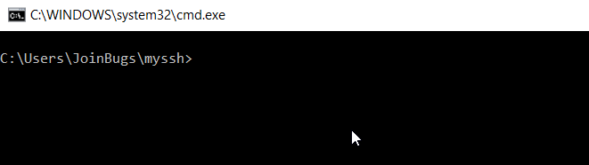

Figura 1.7

Paso 3 - Agregar la clave privada al ssh-agent.
Otro paso fácil , tan solo tenemos que agregar la clave ssh privada(  ojo, tiene que ser la privada es decir la que no tiene extensión), para ello ejecutamos el siguiente comando: ssh-add y le pasamos como parámetro el nombre de nuestra llave privada, que para el caso expuesto de ejemplo lo nombre myssh, queda como se muestra en la figura 1.8

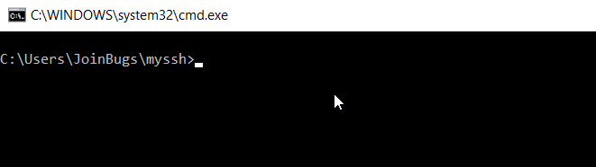

Figura 1.8

Paso 4 - Agregar la clave ssh publica a la plataforma github.
Este paso puede variar dependiendo de las actualizaciones que posteriormete haga github a su plataforma, pero igual creo non debería ser difícil, que puedan encontrar las siguientes opciones, así que lo hare respecto a cómo se encuentra la plataforma en la fecha actual en la publique este post, bueno comencemos.  Primero iniciar sesión en GitHub (Ojo, tienen que iniciar sesión con la cuenta diferente, la extra con la que quieren trabajar, no la que ya usaban).
Luego ir a la configuración de su cuenta como se muestra en la figura 1.9

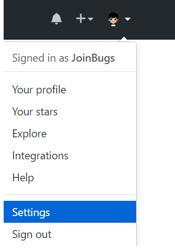

Figura 1.9

Dirigirse a la sección “SSH and GPG keys” como lo muestra la figura 1.10

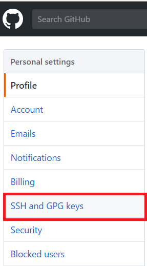

Figura 1.10

Posteriormente dar click en el botón nueva llave SSH (New SSH Key), como lo muestra la figura 1.11

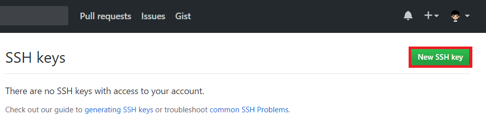

Figura 1.11

Y para finalizar, solo tienen que agregar la llave publica generada, en el campo de texto llamado Key, y darle un nombre a la llave en el campo de texto Title, para el caso de ejemplo, la llave publica se encuentra en el folder myssh/myssh.pub, editamos este archivo y copiamos todo su contenido, nos dirigimos a la plataforma, pegamos y por ultimo damos click en agregar llave ssh(Add SSH Key), como se muestra en la figura 1.12

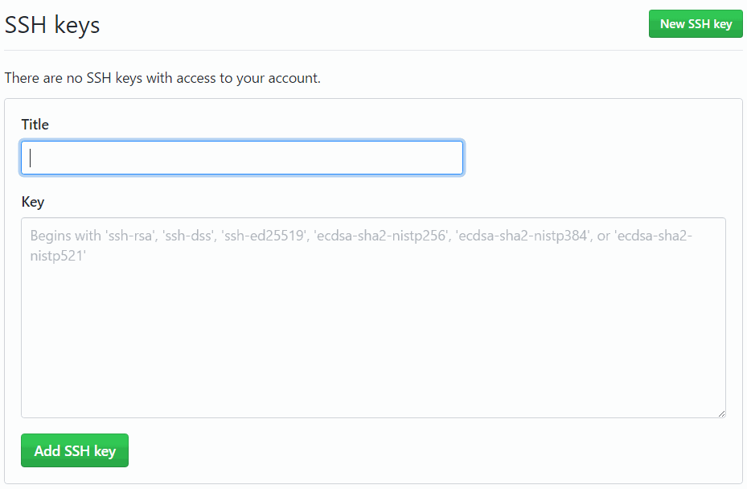

Figura 1.12

Paso 5 - Establecer el seudónimo del repositorio con una url ssh. 
El último paso solo es para comprobar, que todo funciona bien, aquí pueden hacer dos cosas, la primera es clonar alguno de sus repositorios, pero tendrán que clonarlo como SSH, como se muestra en el ejemplo de la figura 1.13

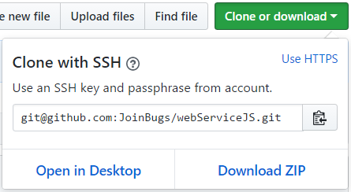

Figura 1.13

La otra es que si ya tenían clonado el repositorio con HTTPS, lo que pueden hacer es cambiar la url del seudónimo que por default tiene el nombre de “origin”, de la manera como se muestra en la figura 1.14, ahora siéntanse libres de hacer push, si todo lo han configurado correctamente, debería de funcionar.

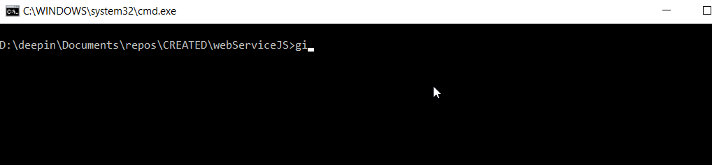

## Conclusiones

Resulta muy importante el saber cómo configurar múltiples cuentas de servidores de terceros o propios donde tengamos alojados repositorios, para trabajar con ellos en la misma maquina cliente, dado que se nos pueden presentar muchas situaciones donde tengamos que crear nuevas cuentas, y se puede volver un verdadero dolor de cabeza si no sabemos cómo hacerlo de forma correcta, pues espero este post les sirva, como posible solución si alguna vez se encuentran metidos en esto.